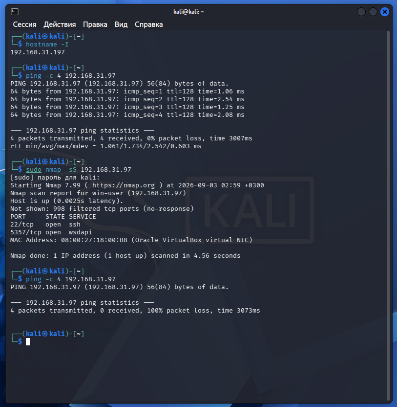
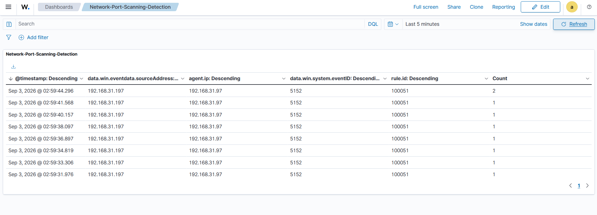
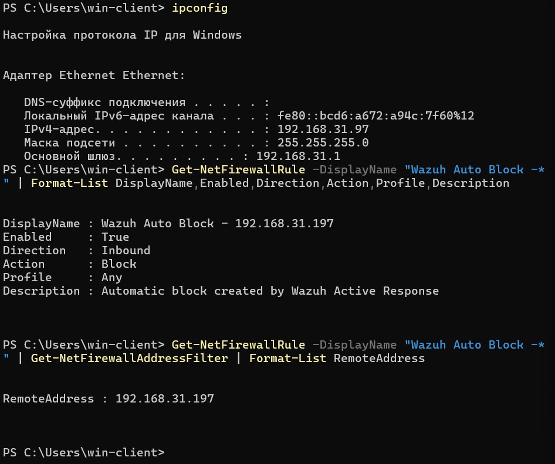

# Wazuh Auto-Block Network Scan

Проект для обнаружения сетевого сканирования и автоматической блокировки IP-адреса источника с помощью Wazuh и Windows Defender Firewall.

Kali выполняет сканирование Windows. Windows фиксирует отброшенные пакеты, Wazuh получает эти события и при достижении заданного порога запускает Active Response. После этого IP-адрес источника автоматически блокируется в Windows Firewall.

## Схема

`Kali` → `Nmap` → `Windows Firewall` → `Event ID 5152` → `Wazuh Agent` → `Wazuh Manager` → `100050 → 100051` → `Active Response` → `Windows Firewall`

## Структура

```text
├── README.md
├── README_ru.md
├── rule.xml
├── ossec.conf
├── ossec-server.conf
├── block-ip.cmd
├── block-ip.ps1
└── screenshots/
    ├── kali-port-scan.png
    ├── wazuh-network-port-scanning-detection.png
    └── windows-firewall-block-rule.png
```

`rule.xml` - правила Wazuh для обнаружения сетевого сканирования

`ossec.conf` - настройки Wazuh Agent на Windows

`ossec-server.conf` - настройки Active Response на Wazuh Manager

`block-ip.cmd` - запуск скрипта Active Response

`block-ip.ps1` - создание правила блокировки в Windows Firewall

## Требования

* Wazuh Manager
* Wazuh Agent
* Windows 11
* Kali Linux
* Nmap

## Установка

### 1. Windows Agent

Добавьте содержимое `ossec.conf` из репозитория в конфигурацию Wazuh Agent

Файл конфигурации:

```text
C:\Program Files (x86)\ossec-agent\ossec.conf
```

Скопируйте `block-ip.cmd` и `block-ip.ps1` в:

```text
C:\Program Files (x86)\ossec-agent\active-response\bin\
```

После изменения конфигурации перезапустите Wazuh Agent

### 2. Wazuh Manager

Добавьте правила из `rule.xml` в:

```text
/var/ossec/etc/rules/local_rules.xml
```

`100050` отслеживает события Windows с `Event ID 5152`. `Event ID 5152` появляется, когда Windows Filtering Platform отбрасывает сетевой пакет. `100051` коррелирует эти события и срабатывает, когда от одного `sourceAddress` приходит 100 событий за 10 секунд.

Для Active Response добавьте настройки из `ossec-server.conf` в:

```text
/var/ossec/etc/ossec.conf
```

Проверьте конфигурацию:

```bash
sudo /var/ossec/bin/wazuh-analysisd -t
```

Если ошибок нет, перезапустите Wazuh Manager:

```bash
sudo systemctl restart wazuh-manager
```

## Active Response

После срабатывания `100051` Wazuh запускает:

```text
block-ip.cmd → block-ip.ps1
```

Скрипт получает данные события через STDIN, извлекает `sourceAddress`, проверяет IPv4-адрес и создает правило Windows Firewall:

```text
Wazuh Auto Block - <IP>
```

Правило блокирует входящий трафик от IP-адреса источника

## Тестирование

Сначала проверяем соединение между Kali и Windows:

```bash
ping -c 4 <WINDOWS_IP>
```

Запускаем SYN-сканирование:

```bash
sudo nmap -sS <WINDOWS_IP>
```

После срабатывания Active Response снова проверяем соединение:

```bash
ping -c 4 <WINDOWS_IP>
```

На Windows проверяем созданное правило:

```powershell
Get-NetFirewallRule -DisplayName "Wazuh Auto Block -*" | Format-List DisplayName,Enabled,Direction,Action,Profile,Description
```

Проверяем IP-адрес, который был заблокирован:

```powershell
Get-NetFirewallRule -DisplayName "Wazuh Auto Block -*" | Get-NetFirewallAddressFilter | Format-List RemoteAddress
```

В Wazuh Dashboard срабатывание можно найти по `rule.id`:

```text
100051
```

Одно сканирование может вызвать несколько срабатываний `100051`. Это связано с тем, что сканирование создает много событий `5152`, а правило корреляции обрабатывает их группами по 100 событий за 10 секунд.

## Результат

В тесте сканирование с Kali создало большое количество событий `5152`. После достижения порога сработало правило `100051`, Wazuh запустил Active Response, а Windows автоматически создал правило блокировки для IP-адреса Kali.

### Kali



Сначала Windows отвечает на запросы Kali. После срабатывания блокировки ответы прекращаются.

### Wazuh



Wazuh показывает срабатывание правила `100051` и IP-адрес источника.

### Windows Firewall



Windows Firewall содержит автоматически созданное правило `Wazuh Auto Block` с IP-адресом источника.
